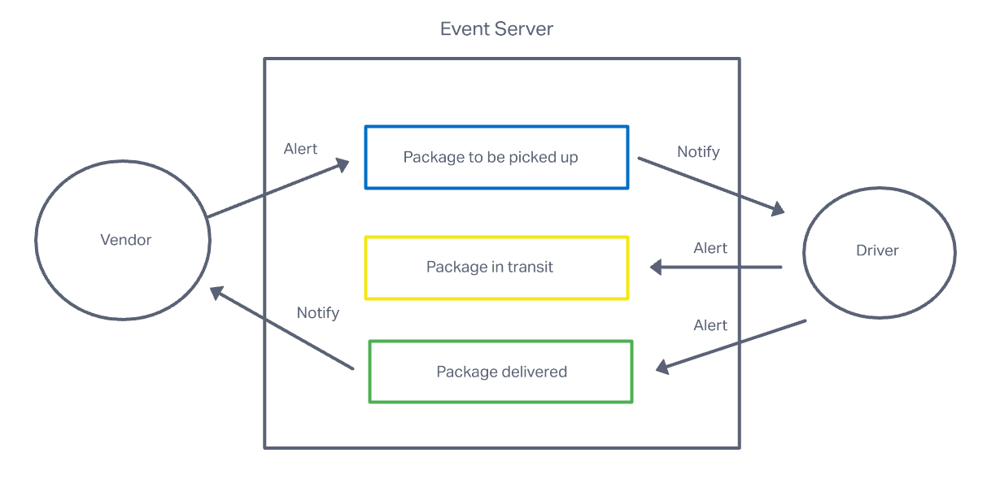
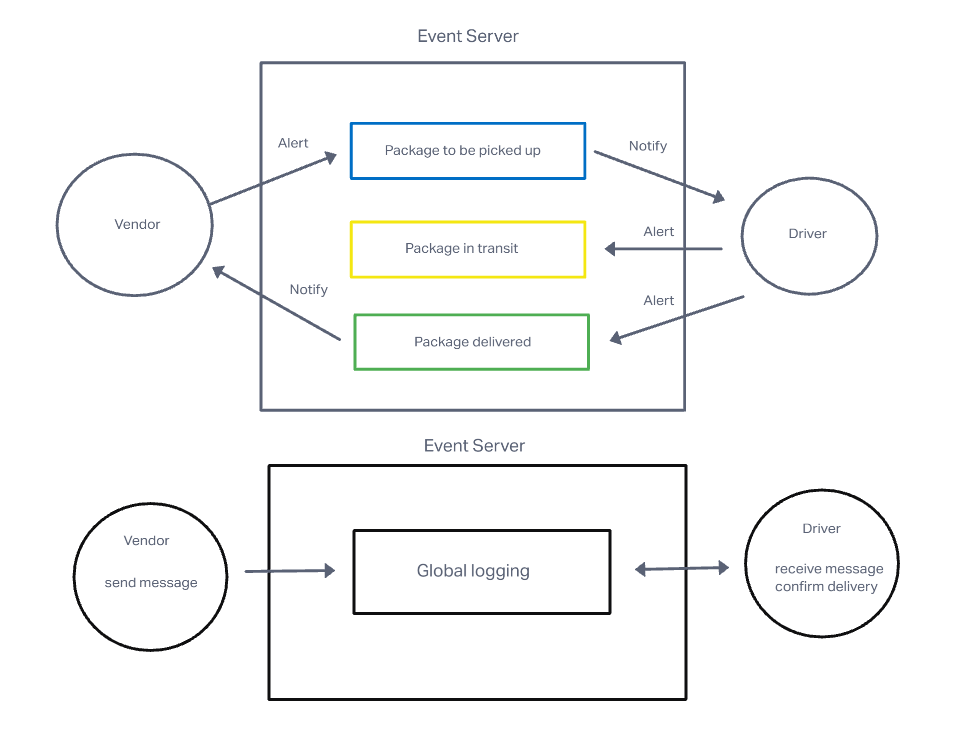

# LAB 11 & 12

## Project: CAPS

### Author: Simon Son

### Problem Domain

#### Lab 11

* Setup a pool of events and handler functions, with the intent being to refactor parts of the system throughout the week, but keep the handlers themselves largely the same. The task of “delivering a package” doesn’t change (the handler), even if the mechanism for triggering that task (the event) does.

#### Lab 12

* Continue working on a multi-day build of our delivery tracking system, creating an event observable over a network with Socket.io.

### Links and Resources

* [GitHub](https://github.com/sson68x/CAPS/pull/2)
* [Class Demo](https://github.com/codefellows/seattle-javascript-401d47/tree/main/class-12)

### Setup

#### `.env` requirements (where applicable)

* N/A

#### How to initialize/run your application (where applicable)

* node/nodemon

### Feature

#### The core functionality

* As a vendor, I want to alert the system when I have a package to be picked up.
* As a driver, I want to be notified when there is a package to be delivered.
* As a driver, I want to alert the system when I have picked up a package and it is in transit.
* As a driver, I want to alert the system when a package has been delivered.
* As a vendor, I want to be notified when my package has been delivered.
* As a developer, I want to create network event driven system using Socket.io so that I can write code that responds to events originating from both servers and client applications.

#### UML Diagram

<!-- ; -->
;
