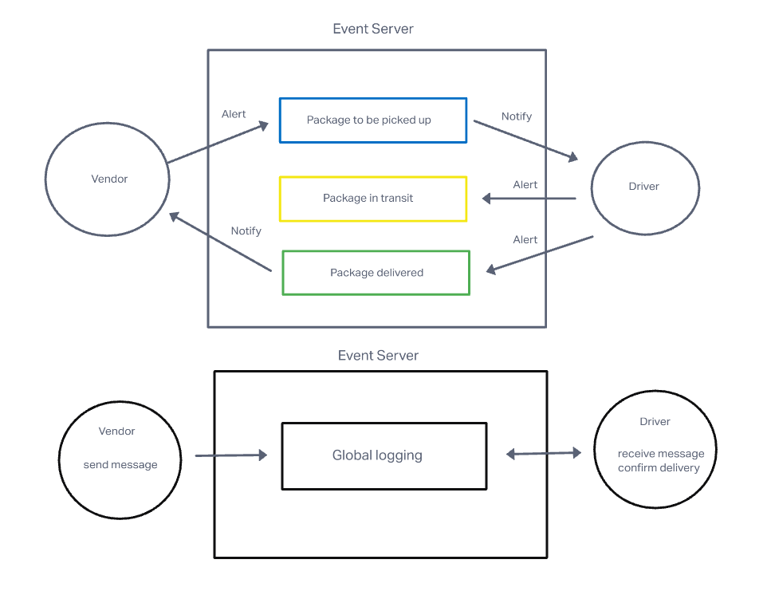

# LAB 11, 12 & 13

## Project: CAPS

### Author: Simon Son

### Problem Domain

#### Lab 11

* Setup a pool of events and handler functions, with the intent being to refactor parts of the system throughout the week, but keep the handlers themselves largely the same. The task of “delivering a package” doesn’t change (the handler), even if the mechanism for triggering that task (the event) does.

#### Lab 12

* Continue working on a multi-day build of our delivery tracking system, creating an event observable over a network with Socket.io.

#### Lab 13

* Build a set of features to help manage deliveries made by CAPS Drivers. This will simulate a delivery driver receiving a list of orders from a Queue and “scanning” package codes on delivery. Retailers will be able to see in their dashboard or log, a list of all packages delivered in real time. Should a delivery driver deliver many packages while the retailer is not connected to the dashboard, the vendor client should be guaranteed to receive “delivery” notifications from the Queue system.

### Links and Resources

* [GitHub](https://github.com/sson68x/CAPS/pull/4)
* [Class Demo](https://github.com/codefellows/seattle-javascript-401d47/tree/main/class-13)

### Setup

#### `.env` requirements (where applicable)

* N/A

#### How to initialize/run your application (where applicable)

* node index.js

### Feature

#### The core functionality

* As a vendor, I want to “subscribe” to “delivered” notifications so that I know when my packages are delivered.
* As a vendor, I want to “catch up” on any “delivered” notifications that I might have missed so that I can see a complete log.
* As a driver, I want to “subscribe” to “pickup” notifications so that I know what packages to deliver.
* As a driver, I want to “catch up” on any “pickup” notifications I may have missed so that I can deliver everything.
* As a driver, I want a way to “scan” a delivery so that the vendors know when a package has been delivered.

#### UML Diagram

;
